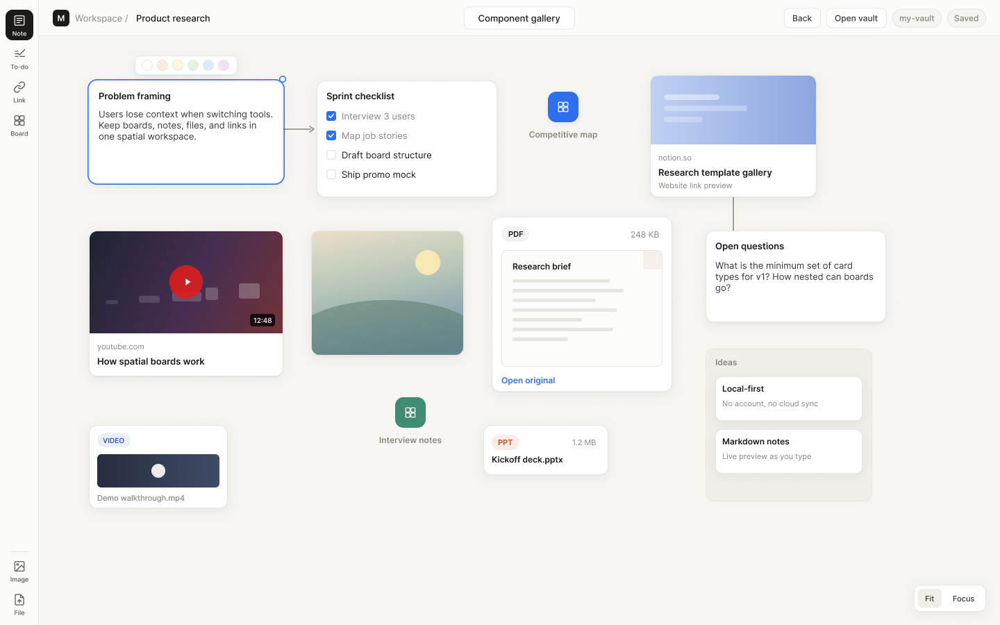

# OpenMila

**Local-first visual canvas** — a Milanote-like board for notes, todos, links, files, and nested boards. Runs entirely in your browser. Data stays in a folder you choose. No login, no cloud, no account.



<p align="center">
  
  
  
</p>

---

## Why OpenMila

Most visual boards want an account and a server. OpenMila is the opposite:

- **Local vault** — pick a folder; boards, markdown notes, and assets live there as plain files
- **Spatial thinking** — freeform cards, connections, nested boards
- **Self-hosted** — clone the repo, build, run on your machine
- **Private by design** — no tracking, no sync service, no remote control

Requires a **Chromium-based browser** (Chrome or Edge) for the [File System Access API](https://developer.mozilla.org/en-US/docs/Web/API/File_System_Access_API).

---

## Features

| Card / capability | What you get |
|-------------------|--------------|
| **Note** | Markdown notes with live preview |
| **To-do** | Checklists with progress |
| **Link** | URL cards with website and YouTube previews |
| **Image** | Drop or import images onto the canvas |
| **File** | PDFs (inline preview), docs, media, and more |
| **Board** | Nested canvases inside canvases |
| **Column** | Stack related cards in a list |
| **Edges** | Connect cards with arrows and optional labels |
| **Canvas** | Pan, zoom, Fit, Focus, card colors |

Everything is stored in your vault as readable files (JSON layouts, `.md` bodies, binary assets).

---

## Run from source

This is the recommended way to use OpenMila.

### Prerequisites

- [Node.js](https://nodejs.org/) 18 or newer
- Chrome or Edge

### 1. Clone and install

```bash
git clone https://github.com/steven-lijw/openmila.git
cd openmila
npm install
```

### 2. Development (hot reload)

```bash
npm run dev
```

Open the URL Vite prints (usually `http://localhost:5173`).

### 3. Production build + local server

```bash
npm run build
node bin/openmila.js
```

That serves the built app and opens it in your browser. Useful flags:

```bash
node bin/openmila.js --port 3456   # fixed port
node bin/openmila.js --port 0      # OS-assigned free port
node bin/openmila.js --no-open     # server only, no browser
node bin/openmila.js --help
```

Default port is `30142` when none is specified.

### First launch

1. Click **Choose vault folder** (or **Open vault**)
2. Select an empty folder (or an existing OpenMila vault)
3. Drag tools from the left rail onto the canvas

Your workspace is just that folder. Back it up, copy it, or open it in another machine the same way.

---

## Project structure

```
openmila/
├── bin/openmila.js       # Local HTTP server + CLI launcher
├── lib/fetchMeta.js      # Link metadata helper (server-side)
├── src/
│   ├── components/       # UI: toolbar, canvas, editors, previews
│   ├── core/             # Board logic, edges, file/link previews
│   ├── state/            # Workspace controller
│   ├── storage/          # File System Access + IndexedDB helpers
│   ├── App.tsx
│   ├── main.tsx
│   ├── types.ts
│   └── styles.css
├── docs/
│   └── promo-showcase.png
├── dist/                 # Output of npm run build
├── package.json
└── vite.config.ts
```

### Scripts

| Command | Purpose |
|---------|---------|
| `npm run dev` | Vite dev server |
| `npm run build` | Production bundle → `dist/` |
| `npm run preview` | Preview the production build with Vite |
| `npm run typecheck` | TypeScript check |
| `node bin/openmila.js` | Serve `dist/` and open the app |

---

## Vault layout (overview)

A vault is a normal directory, roughly:

```
my-vault/
├── workspace.json
├── boards/
│   └── …             # board JSON + card documents
└── …                 # images, files, assets as needed
```

You can inspect or edit files outside the app when you need to. Prefer doing structural edits in OpenMila so layout metadata stays consistent.

---

## Browser support

| Browser | Support |
|---------|---------|
| Chrome | Yes |
| Edge | Yes |
| Firefox / Safari | Not targeted (no full File System Access API for this workflow) |

---

## License

[MIT](LICENSE)
